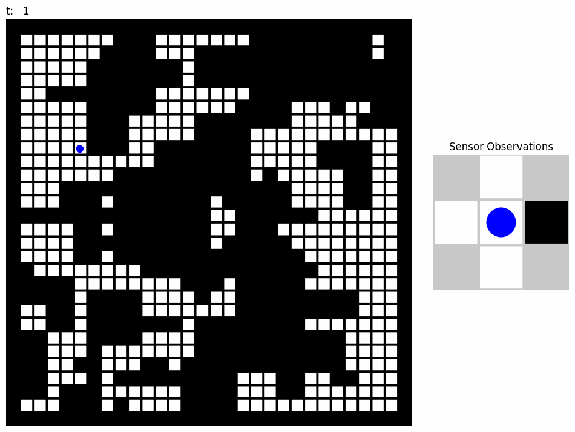

# Estimation & Classification Course Project: Localization with HMMs

<p align="center">
  
  
</p>


## Description
Final project for the Estimation & Classification course at Instituto Superior Técnico (IST) in Lisboa taught by [Professor Alexandre Bernardino](https://sites.google.com/view/alexbernardino/home). The goal for this project is for students to model robot self-localization as a Hidden Markov Model (HMM) in a 2D gridworld using the provided simulator and visualizer.  

Explore example results in the interactive display: [https://alcedok.github.io/IST-EC-course-project/](https://alcedok.github.io/IST-EC-course-project/). 

If you find any problems/bugs or are interested in extending the code: open an issue, fork the repository and create a merge request with a description of the changes.

## Features:
- Random generation and simulation of partially observable gridworlds implemented with [Farama's Gym Environment](https://gymnasium.farama.org/).
- Visualization of global state and local observations with an overlay of state probability distribution (belief).
- Interactive display:
	 - Saves results on the `/results` directory and view them by opening `index.html` on your local browser
 - Pre-loaded examples on Github Pages ([link](https://alcedok.github.io/IST-EC-course-project/)).


## Student Tasks:
- Familiarize yourself with the framework on `demo.ipynb`
- Formulate the problem as an HMM and implement the following, making sure to follow their input/output specification in the doctring for compatibility with downstream methods:
	1) Transition and observation models, `calculate_transition_matrix()` and `calculate_observation_matrix()` correspondingly, in `environment.py`
		- Start by looking at `reset()` in `environment.py`, you will notice that the world is generated first and then the environmental models.
		- You may want to use the pre-generated id lookup and reverse-lookups in `environment.py`: `transition_matrix_lookup`, `transition_matrix_reverse_lookup`, `observation_id_lookup` and `observation_id_reverse_lookup`.
	2) An additional initial probability initialization mode in `init_probabilities()` in `utils.py`, currently only `mode=uniform` is provided
	3) Localization of a robot navigating the environment inside the method `get_state_probabilities()` in `localization.py`
- Completion/submission details can be found in the project document found in the course website

## Installation
1. Clone the repository:

   ```bash
   git clone https://github.com/alcedok/IST-EC-course-project.git
   ```
2. Install dependencies (tested on python 3.10.13):
    ```bash
    pip install -r requirements.txt
    ```
3. Start with the notebook `demo.ipynb`

## Authors
- [Kevin Alcedo](kevin.alcedo@tecnico.ulisboa.pt) 
- [Dinis Miranda](dinis.miranda@tecnico.ulisboa.pt)
- [Prof. Alexandre Bernardino](alex@isr.tecnico.ulisboa.pt)
- Prof. Jorge Salvador-Marques

## Implementation Details
- 2D Gridworld: 
	- encapsulated as a [Gym.Environment](https://gymnasium.farama.org/)
	- generated with random obstacles
	- transition and observation matrices are calculated for each new world
- Default robot motion:
	- robot follows a uniform random policy over observable valid actions, i.e. the robot only considers moving towards free-cells it observes. 
	- since the robot has limited sensing (N,E,S,W) it may consider an invalid action (all eight neighbors including 'stay in place')
	- if an invalid action is taken, the environment prevents the robot from moving; i.e. the robot stays in place
- Robot perception:
	- robot perceives obstacles in (N,E,S,W) 
	- observations are modeled as a binary vector, i.e. (1,0,1,0) corresponds to perceived obstacles in N,S 
- Self-localization (your task):
	- Model the robot dynamics as an HMM and estimate the probability distribution of the robot on the grid at time $t$
- Visualization:
	- On the left: 
		- grid with robot ground-truth position
		- probability distribution superimposed over the grid-cells
	- On the right:
		- egocentric observations